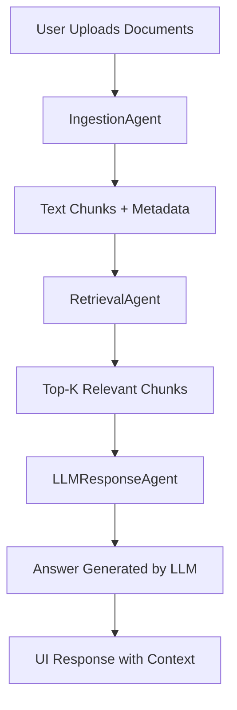

# 🤖 Agentic RAG Chatbot using Model Context Protocol (MCP)

This project is a modular, agent-based Retrieval-Augmented Generation (RAG) chatbot that answers user questions based on uploaded documents in multiple formats (PDF, DOCX, PPTX, CSV, TXT). It uses semantic search with vector embeddings and an LLM to provide relevant and accurate answers. The architecture uses structured message passing via a custom **Model Context Protocol (MCP)** for communication between agents.

---

## 📌 Features

✅ Supports Multi-format Document Upload:
- PDF, PPTX, DOCX, CSV, TXT/Markdown

✅ Agent-Based Design:
- `IngestionAgent`: Parses and preprocesses documents
- `RetrievalAgent`: Embeds + retrieves relevant chunks
- `LLMResponseAgent`: Constructs prompts and generates answers

✅ Uses MCP (Model Context Protocol) for inter-agent messaging:
```json
{
  "sender": "RetrievalAgent",
  "receiver": "LLMResponseAgent",
  "type": "CONTEXT_RESPONSE",
  "trace_id": "abc-123",
  "payload": {
    "top_chunks": ["..."],
    "query": "What KPIs were tracked?"
  }
}
```

✅ Built-in Vector Store:
- FAISS for semantic similarity search
- Sentence-Transformer (`all-MiniLM-L6-v2`) for embeddings

✅ Clean & Interactive UI:
- Upload documents
- Ask multi-turn queries
- View contextual answers

---

## 🏗️ System Architecture



All agents communicate via structured JSON (MCP messages).

---

## 🧠 Tech Stack

| Layer        | Tool |
|--------------|------|
| Language     | Python 3.8+ |
| Embeddings   | Sentence-Transformers (HuggingFace) |
| Vector Store | FAISS |
| UI Framework | Streamlit / Flask |
| File Parsing | PyMuPDF, python-docx, python-pptx, pandas |

---

## 🚀 Setup Instructions

### 1. Clone the Repository
```bash
git clone https://github.com/yourusername/agentic-rag-chatbot.git
cd agentic-rag-chatbot
```

### 2. Create & Activate Virtual Environment
```bash
python -m venv venv
source venv/bin/activate  # on Windows: venv\Scripts\activate
```

### 3. Install Dependencies
```bash
pip install -r requirements.txt
```

### 4. Run the App
```bash
python app.py
```

---

## 📸 Screenshots

> _Include the following screenshots:_
- Home page with upload panel
- Chat window with a user question + bot answer
- Example file formats being processed

---

## 🖼️ Presentation (PPT)

📎 [Download the Architecture Presentation](docs/Agentic_RAG_Presentation.pdf)

---

## 🎯 Sample MCP Message Flow

```json
{
  "type": "RETRIEVAL_RESULT",
  "sender": "RetrievalAgent",
  "receiver": "LLMResponseAgent",
  "trace_id": "rag-457",
  "payload": {
    "retrieved_context": ["slide 3: revenue up", "doc: Q1 summary..."],
    "query": "What KPIs were tracked in Q1?"
  }
}
```

---

## 🎥 Demo Video (Optional)

📽️ [Watch the Demo & Architecture Walkthrough](https://your-link-to-demo.com)

---

## 🧩 Challenges Faced

- Managing chunk overlaps across varied document structures
- Avoiding `KeyError` on edge-case retrieval
- Handling multi-modal file parsing (e.g., nested tables in PPT)
- Managing GPU/CPU resource usage for LLM response

---

## 🚀 Future Scope

- Add support for images/diagrams using OCR
- Upgrade to LangChain Agents or Autogen for scalability
- Integrate OpenAI API or local LLMs for response generation
- Add persistent vector DB support (e.g., Chroma, Weaviate)

---

## 👤 Author

**Aazam Shareef**  
📞 +91-8328476955  
📧 aezamsos@gmail.com  
🔗 [LinkedIn](https://www.linkedin.com/in/aazam-shareef-234170171)

---

## 📄 License

This project is licensed under the MIT License.
